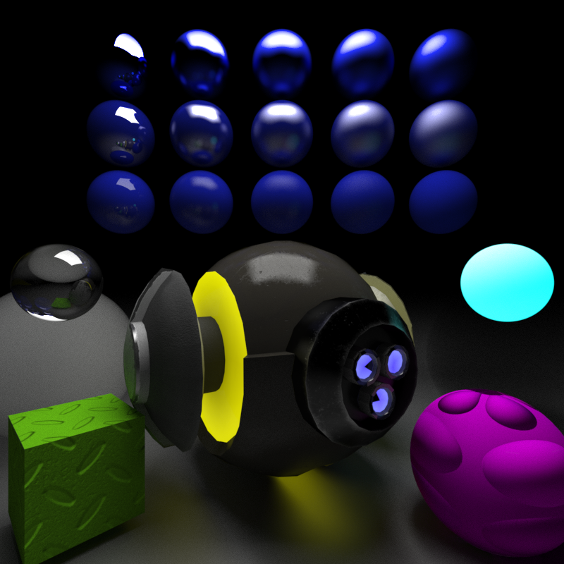

# CS397 Spring 2022 - Ray Tracing Study
Michael Korenchan | Computer Science | Univesity of Illinois

## Current Render:
 

 

## Progress Log:
- **Week of Jan 21:**
  - Wrote my first Rust program! 
  - Went thorugh lots of tutorials
- **Week of Jan 28:**
  - Started something along the lines of 419 MP1
  - Added positional camera and initial ray generation
  - Added ray-sphere intersection
  - Added ray-triangle intersection
  - Currently shades pixel based on normal of first intersection
- **Week of Feb 7:**
  - Added phong shading
  - Added hard shadows
  - Added multi-jittered antialiasing
- **Week of Feb 14:**
  - Added ray-plane intersection
  - Figured out how rust module hierarchies work
  - Reorganized file structure
  - Imported obj parser
  - Implemented obj normal generation
  - Implemented basic AABB ray intersection test
- **Week of Feb 21:**
  - Defined BVH structure
  - Implemented BVH intersection test
  - Implemented (inefficient) BVH construction
  - Now drawing buggy picture of teapot
- **Week of Feb 28:**
  - Fixed BVH bug
  - Added progress bar for sanity while waiting to render
  - Added simple multithreading (still needs optimization)
  - Adjusted mesh memory model (still very much a work in progress)
- **Week of Mar 7**
  - Adjusted multithreating
  - Switched lighting model to recursive rendering equation with lambertian surfaces
  - Added Cornell Box
